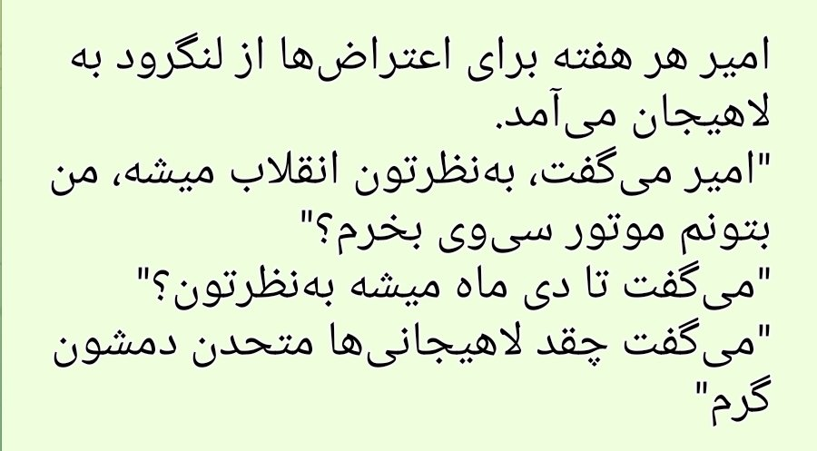

::ref-box{link="https://twitter.com/pkhwshhal/status/1594993461320732674"}

بنا به گفته منابع موثق هر هفته برای حضور در اعتراض‌ها از لنگرود به لاهیجان می‌آمد و در اعتراض‌ها شرکت داشت.

امیرمحمد روز پنجشنبه، ۲۶ آبان درحالی که از اعتراضات لاهیجان به لنگرود بر می‌گشت در اثر تصادف جان‌باخت. تاکید می‌کنم ۲۶ ام، نه ۲۵ ام.

منابع ما در لنگرود پس از مشاهده دوربین‌های جاده‌ای، تصادف امیرمحمد با یک خودرو ۲۰۷ را تایید کردند. راننده پس از تصادف خودرو را رها کرده و می‌رود(احتمال نداشتن گواهینامه مطرح است). پس از آن یک خودرو عبوری از روی بدن امیرمحمد که تا آن لحظه زنده بود، رد می‌شود.

این رشتو تنها برای روشن شدن ابعاد ماجرا منتشر شده، در اینکه امیرمحمد عزیز آزادی‌خواه بود و در همین مسیر جان خودشو از دست داد شکی نداریم. نامش جاودانه شد.

::